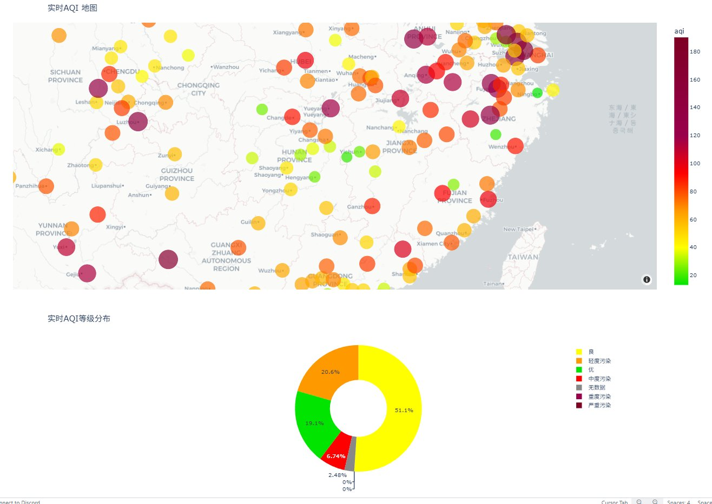
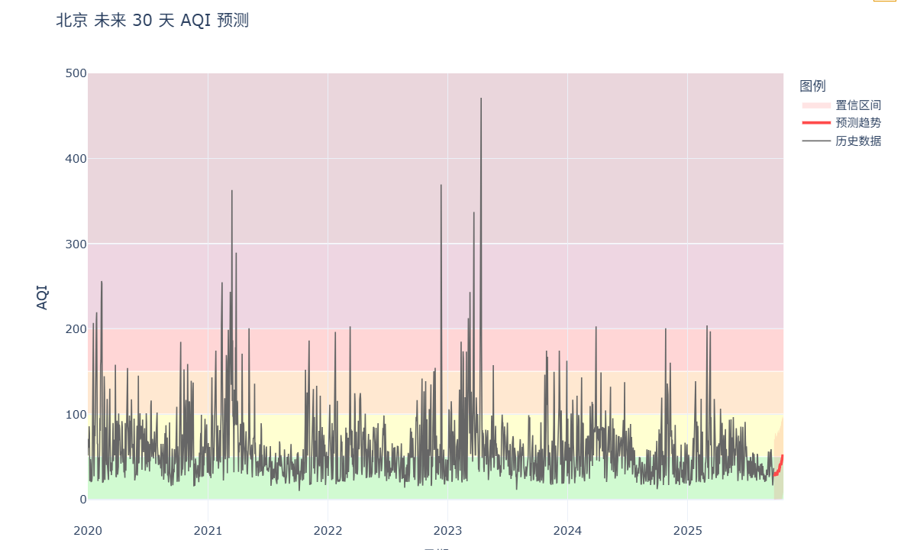
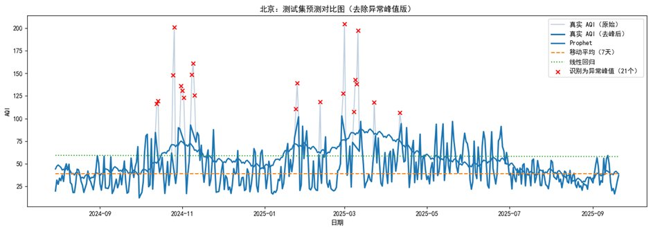

# China Air Quality Monitoring & Forecasting System

A full-stack data science project that collects, cleans, analyses, and forecasts air quality (AQI) across major Chinese cities (2020–2024), with an interactive Streamlit dashboard.

---

## Screenshots

**Realtime AQI Map — live city-level air quality across China**


**30-Day AQI Forecast — Prophet time-series prediction with confidence intervals**


**Model Evaluation — test set prediction vs actual (outlier detection included)**


---

## Features

| Module | Description |
|---|---|
| **Data Pipeline** | Collected real-time & historical AQI data from WAQI API across 300+ cities |
| **Data Cleaning** | Handled missing values, outliers, and standardised multi-source data |
| **Forecasting** | Per-city AQI forecasting using Facebook Prophet (time-series) |
| **Dashboard** | Multi-page Streamlit app — Realtime, History, Predict, Health pages |
| **Auth System** | Login system backed by MySQL |

---

## Tech Stack

- **Language**: Python 3.10+
- **Dashboard**: Streamlit
- **Forecasting**: Prophet, scikit-learn
- **Visualisation**: Plotly
- **Data**: Pandas, NumPy
- **Database**: MySQL (login system)
- **Data Source**: [WAQI API](https://aqicn.org/api/)

---

## Project Structure

```
├── 01_data_overview.ipynb       # EDA and data exploration
├── 02_data_cleaning.ipynb       # Data cleaning pipeline
├── 03_model_train.ipynb         # Model training and evaluation
├── 04_prophet_.ipynb            # Prophet forecasting experiments
├── air_quality_fyp/
│   ├── app.py                   # Streamlit main app
│   ├── pages/
│   │   ├── 01_Realtime.py       # Live AQI map
│   │   ├── 03_History.py        # Historical trends
│   │   ├── 04_Predict.py        # AQI forecast (Prophet)
│   │   └── 05_Health.py         # Health recommendations
│   ├── src/
│   │   ├── api_client.py        # WAQI API wrapper
│   │   ├── data_loader.py       # Data loading utilities
│   │   ├── prophet_model.py     # Forecasting logic
│   │   └── auth.py              # Login/auth system
│   └── scripts/                 # Batch training & data scripts
└── requirements.txt
```

---

## Setup & Run

### 1. Install dependencies
```bash
pip install -r requirements.txt
```

### 2. Configure secrets
Create `air_quality_fyp/.streamlit/secrets.toml`:
```toml
WAQI_TOKEN = "your_token_here"   # Get free token at aqicn.org/api/
DB_HOST = "localhost"
DB_NAME = "air_quality"
DB_USER = "root"
DB_PASS = "your_password"
DB_PORT = "3306"
```

### 3. Set up MySQL database
```sql
CREATE DATABASE air_quality;
```

### 4. Run the dashboard
```bash
cd air_quality_fyp
streamlit run app.py
```

App opens at `http://localhost:8501`

---

## Notebooks

| Notebook | Purpose |
|---|---|
| `01_data_overview.ipynb` | Dataset exploration, distributions, city coverage |
| `02_data_cleaning.ipynb` | Full cleaning pipeline with validation |
| `03_model_train.ipynb` | Model selection, training, MAE/RMSE/R² evaluation |
| `04_prophet_.ipynb` | Prophet time-series forecasting per city |

---

## AQI Standard (HJ 633—2012)

| AQI Range | Level | Meaning |
|---|---|---|
| 0–50 | Excellent | No health impact |
| 51–100 | Good | Acceptable |
| 101–150 | Lightly Polluted | Sensitive groups affected |
| 151–200 | Moderately Polluted | General public affected |
| 201–300 | Heavily Polluted | Serious health effects |
| 301–500 | Severely Polluted | Emergency conditions |
